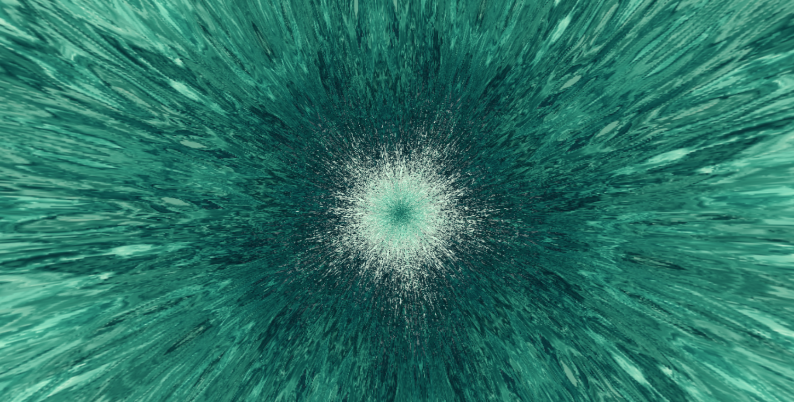

# Kaleidoscope



Browser kaleidoscope studio. A folded, warped, interfering field, fed by noise,
by a painted plate, or by your own image.

**[Live demo →](https://norikdavtian.github.io/kaleidoscope/)**

Everything runs client-side. No image you load ever leaves the machine.

## Two ways to run it

**Standalone** — open `kaleidoscope-studio-polycentral.html` in a browser. No
build step, no server. Everything works except sharing an uploaded image.

**As an app** — a Next.js wrapper that adds S3-backed uploads and permalinks:

```bash
npm install
cp .env.example .env.local   # optional — permalinks work without it
npm run dev
```

Without S3 credentials the app still runs: generations persist to `.data/` and
permalinks resolve. Only uploading a shared image needs a bucket, and
`/api/upload` returns a clear 503 until one is configured.

`src/` is the source of truth. `npm run build-studio` composes it into both
delivery targets:

| Source | Built into |
| --- | --- |
| `src/head.html` | |
| `src/studio.css` | the standalone HTML, and `public/studio/studio.css` |
| `src/studio.html` | the standalone HTML, and `public/studio/markup.html` |
| `src/studio.js` | the standalone HTML, and `public/studio/studio.js` |

Edit `src/`, run the build, never edit the generated files.

### App layout

| Path | Purpose |
| --- | --- |
| `app/page.tsx` | The studio. |
| `app/g/[id]/page.tsx` | A saved generation, with its source image. |
| `app/api/upload` | Presigned PUT — the browser uploads straight to S3. |
| `app/api/share` | Stores a generation; `GET /api/share/[id]` reads it back. |
| `lib/s3.ts` | S3 client. Works with AWS, R2, MinIO, B2 via `S3_ENDPOINT`. |
| `lib/shareStore.ts` | Generation records. Falls back to `.data/` on disk when S3 is unconfigured, so permalinks work locally with no credentials. |
| `scripts/build-studio.mjs` | Composes `src/` into the standalone HTML and the served assets. |

The bucket needs CORS allowing `PUT` from your origin for uploads, and `GET`
for reading a shared source back — the renderer samples image pixels, so a
tainted cross-origin canvas would fail.

## Files

`kaleidoscope-studio-polycentral.html` is the standalone build — GPU renderer,
polycentral tilings, image sources. Open it directly in a browser: no build
step, no server. (Earlier iterations live in git history.)

## How it renders

Two GPU passes, split by what actually changes:

1. **Field pass** — solves the whole field in a fragment shader and writes it to
   a texture: the palette phase packed across two bytes, plus the shade. Runs
   only when a parameter that shapes the field moves (~1.3 ms).
2. **Colour pass** — reads that texture, applies the palette ramp, seam glow and
   image blend. This is the only thing that has to keep up with the display.

Radial mode composites the buffer straight to the canvas. The tessellated modes
reflect it across cell edges on a 2D canvas, from a once-per-frame downscaled
copy so a hundred-plus cell blits stay same-size copies rather than resamples.

Measured on an integrated GPU at 1024² field, 817×854 viewport:

| | per frame |
| --- | --- |
| Radial | 4.9 ms |
| Square | 4.2 ms |
| Triangle | 3.7 ms |
| Field re-solve (parameter change) | 1.3 ms |

A CPU path is kept as a fallback and is used automatically when WebGL is
unavailable. It is much slower — the field solve alone was ~1.8 s at full
resolution, which is what motivated the move to the GPU.

## Roadmap

- **Camera input.** Video files already work as sources; a live camera is the
  same path plus a `getUserMedia` permission flow.
- Curated public-domain artwork sources with on-canvas attribution.
- The remaining two of Brewster's four polycentral shapes: the 90-45-45 and
  90-60-30 triangles.
- Export a loop as video rather than a single PNG.
- Drop the p5 dependency entirely — it is now only used for the main canvas and
  for painting the built-in plates.

## Generation IDs

Every parameter that shapes the output is packed into the URL hash, so a link
reopens exactly the same image — the field is a pure function of those values
and nothing else. The panel shows a short id (e.g. `0XOR9SV`) derived from the
same state, for quoting a result without pasting a URL.

`Copy link` registers the generation and gives you the short `/g/<id>` form when
a backend is reachable, falling back to the self-contained `#s=` link when the
file is opened standalone.

Built-in plates travel by id. Standalone, a custom upload stays on your machine
and does not travel with the link. Under the app it is stored, and the link
becomes `/g/<id>` and carries the image too.

## Sources

Beyond the nine painted plates, `BASE_PLATES` entries can carry:

- `src` — a photograph. Paths resolve against several roots so one file works
  whether served by the app or opened off disk.
- `video` — an MP4, drawn to a canvas and re-uploaded to the GPU each frame.
  Give it a `poster` for the thumbnail.
- `animated: true` alongside `src` — an animated GIF or WebP. Its frames are
  decoded up front with `ImageDecoder` and cycled by their own declared
  durations, rather than left to an ``: a browser suspends animation on an
  image it judges invisible, and a source image has to be invisible.
- `anim: true` — repainted procedurally each frame (see the Wink plate).

Any entry whose file is missing removes itself from the grid.

The Interference plate is drawn from a single equation rather than painted:
I(**r**) ∝ |Σ¹²ᵢ₌₁ A·e^{i(**k·r** + φᵢ)}|² — twelve plane waves spaced around
the circle, summed as a complex field and squared, solved once per colour
channel at its own wavenumber (k ∈ [24, 32]) so the fringes come out
chromatic. The phases drift, each at its own speed, which is what animates
it. Only the phases move, so cos/sin of **k·r** are precomputed per wave and
per channel, and each frame is a phase rotation over those tables rather
than trig per pixel.

## Seeing an image in the mirrors

Radial mode folds the plane into one wedge, so the sampler only ever reads a
**sector** of the source — `π / folds` wide, anchored at the pan point. At 10
folds that is an 18° slice: most of the picture cannot appear at all, which is
why an upload tends to come out as texture rather than as its subject.

The tessellated modes sample a rectangular patch and mirror it across cell
edges, which is what a real polycentral scope does and what makes whole faces
show up in the reference. For a recognisable subject:

| Setting | Value |
| --- | --- |
| Symmetry | **Triangle** (or Square) |
| Zoom | 0.5 – 0.7 |
| Cell Size | 280 – 340 |
| Field Mix | 0 |
| Image Warp | 0 |
| Pan X / Y | centre on the subject |

Note that Zoom runs the opposite way to the word: a *higher* value fits more of
the image into each cell, so features come out smaller. Lower magnifies.

## Breathing

A meditation mode. The colour ramp runs forward on the inhale and back on the
exhale — rocking rather than scrolling, so it has somewhere to come to rest —
and the whole field swells and settles with it. A ring on the canvas expands and
contracts with the count.

| Pattern | Seconds |
| --- | --- |
| Box | 4 in · 4 hold · 4 out · 4 hold |
| Calm | 4 in · 7 hold · 8 out |
| Deep | 6 in · 7 out, no holds |
| Longer | starts at 4·2·6·1 and stretches to 1.8x over ~5 minutes |

The guide is a shell of particles: directions laid out on a Fibonacci sphere,
thinned by noise so the field breaks into filaments and voids rather than an even
fog, with the far side dimmed so a flat scatter of points reads as a sphere. It
turns slowly and breathes with the count. `Orb Size` and `Orb Strength` set how
far it reaches and how hard it carries; a shallow darkening sits behind it so the
points have something to read against on a bright plate.

Brightness and radius are fixed in object space and computed once — only the
rotation changes per frame. The backing canvas is capped at 300px and CSS scales
it, since clearing and uploading the buffer dominates and grows with the square
of the side.
`Breath Depth` sets how far the swing carries. The guide sits in the middle of
the canvas — a soft glow rather than an outline, so it sits *in* the artwork
rather than on top of it — and the orb and the stage label switch on and off
independently — the orb is off by default, leaving just the count. The label sits below the orb, at its
centre, or pinned near the bottom of the frame, at whatever size suits.
Breathing runs independently of the Animate button.

## Opening

The welcome disc sits over the live scope, running the same particle shell as
the breath guide behind its text — dimmer, slower, and with a well of darkness
behind the points so the words stay legible against them. It waits: there is no
timer. Click past the disc, or press Enter, Space or Esc — clicking the disc
itself does nothing, since it carries a link and a share button. `I` brings it
back.

The scope opens already in motion, on Animate. Breathing is off by default; when
switched on it takes over the flow, rocking the colour forward and back rather
than scrolling it one way and holding spin to a trace. The two never stack.

## Dock and keys

The controls live in a dock rather than a sidebar: one panel at a time, opened
from the dock or straight from the keyboard.

| Key | |
| --- | --- |
| `1`–`7` | Source · Symmetry · Colour · Motion · Breathing · Parameters · Export |

The panel opens down the left rather than across the middle — the centre of the
artwork is the thing being adjusted, so a sheet parked over it hides the work.
| `R` | Randomize |
| `A` | Animate |
| `F` | Fullscreen |
| `H` | Cinema — hides the dock, sheet, source card and status |
| `S` | Save a PNG |
| `I` | About |
| `Esc` | Close the panel, or leave cinema |

Keys are ignored while a text field has focus. With the intro up, only Enter,
Space and Esc do anything, and all three dismiss it.

## Edge

Symmetry carries an optional mask that floats the piece on black: **Disc**,
**Petal**, **Scallop** or **Bloom**. The boundary follows the mirror count
rather than being a plain circle, and is always blurred — a hard cut reads as a
crop, a soft one as the end of the mirrors. Size and softness are adjustable.

The mask is composited onto the visible canvas rather than into the field, so it
frames the whole frame in every symmetry rather than repeating per cell. It is
rebuilt only when its shape, size, softness, fold count or the canvas changes.

## Section controls

Every section header carries three small controls:

| | |
| --- | --- |
| **Lock** | Randomize leaves this section exactly as it is. |
| **Dice** | Rolls only this section. |
| **Auto** | Lets this section drift on its own. |

Lock and Auto are mutually exclusive — pinning a section switches its drift off.

Source carries a second, narrower lock beside the thumbnails: **Which image**
pins the chosen picture alone, so Randomize and drift keep it while the zoom,
pan, warp and mix around it stay free. The section lock holds all of that too.

Continuous sections (Motion, Parameters) ease toward a fresh random target every
few seconds, so the image morphs rather than jumping. The sections that can only
step — Symmetry, Seed, Source, Colour — wait a random interval and then
cross-dissolve: the frame is snapshotted before the switch and faded out over
the new one, so a hard cut still reads as a transition.

Auto runs whether or not the Animate button is on; `needsLoop()` keeps the
sketch running while any section is drifting or a dissolve is in flight.

## Colour

Palettes are generated from a single base colour across eight harmony schemes,
each row drawing its own lightness envelope, saturation swing and direction. The
browser widens as it is scrolled — the first rows are close variations on the
chosen colour, and by row 60 or so they have drifted right around the wheel.

The tile format is Gregg Gunn's: a palette shown as a composition rather than a
strip, which previews how the colours sit against each other.

## Credits

Built by [norik.io](https://norik.io).

## Inspiration and credits

- [Leif Gehrmann — Digital Kaleidoscopes](https://leifgehrmann.com/kaleidoscopes/)
  and the [live scope](https://kaleidoscope.leifgehrmann.com/). The write-up on
  why only four mirror arrangements tessellate, and the shape of the landing
  screen and floating toolbar, come from here.
- [kazuhikoarase/kaleidoscope](https://github.com/kazuhikoarase/kaleidoscope)
  (MIT, 2014) — the triangle and square tessellation geometry and the
  counter-rotating cell trick are adapted from it.
- [Anthropic algorithmic-art skill](https://github.com/anthropics/skills/blob/main/skills/algorithmic-art/SKILL.md)
- [Gregg Gunn — How to make your own color palettes](https://medium.com/@greggunn/how-to-make-your-own-color-palettes-712959fbf021),
  for the square palette format used in the browser.
- David Brewster, *A Treatise on the Kaleidoscope* (1819), for the term
  *polycentral* and the underlying optics.

Palette families are restrained on purpose. A kaleidoscope repeats a colour
dozens of times per frame, so a full-spectrum ramp reads as noise rather than as
pattern — every preset stays inside a limited range.
